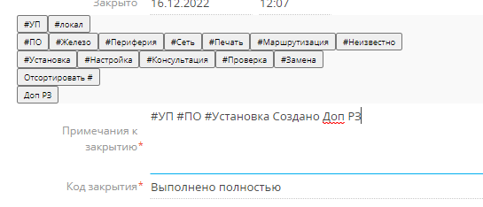

# hashtagTemplates
Этот скрипт помогает при работе с хэштегами в Create.
 

 
## Функции
  * Подсветка поля относительно количества хэштегов
  * Возможность создания собственного многоуровневого набора хэштегов
  * Сортировка хэштегов относительно их уровня
  * Возможность создания собственного набора шаблонов ответов
 
## Установка
 1. Установливаем Tampermonkey https://www.tampermonkey.net/
 2. В расширении заходим в панель управления -> уилиты и импортируем из URL https://raw.githubusercontent.com/VF2048/hashtagTemplates/master/AddHashtag.js
 3. Готово